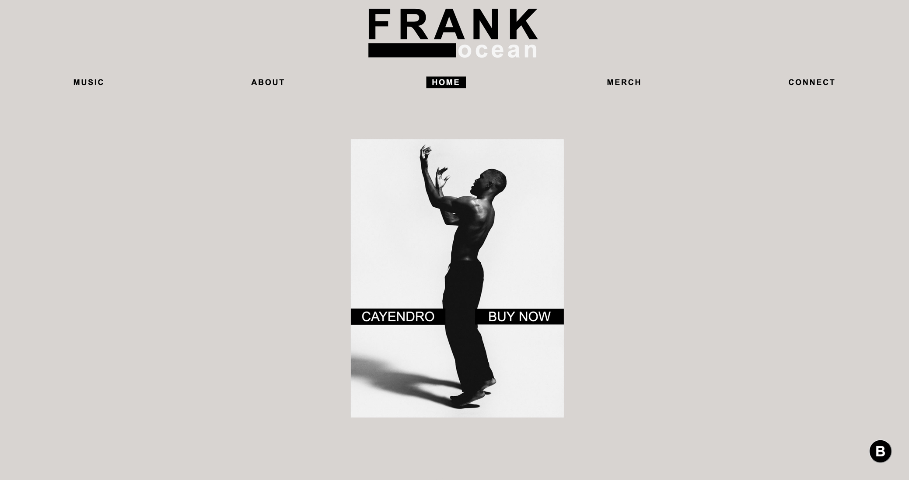

# Re-imagined Blonded

A simple responsive reimagined single page website of the American singer-songwriter Frank Ocean

## Table of contents

- [Overview](#overview)
  - [Screenshot](#screenshot)
  - [Links](#links)
- [My process](#my-process)
  - [Built with](#built-with)
  - [What I learned](#what-i-learned)
  - [Useful resources](#useful-resources)
- [Author](#author)
- [Acknowledgments](#acknowledgments)

## Overview

### Screenshot



### Links

- Live Site URL: [Add live site URL here](https://your-live-site-url.com)

## My process

### Built with

- Semantic HTML5 markup
- CSS
- Flexbox
- JavaScript


### What I learned

While working on this project, I learned a lot about web development and software engineering. Here are some of the key takeaways:
 - Technical skills: I learned how to use javascript to switch between hidden contents without reloading the page. and learned to use event listener to play, pause and reset music.
 - Collaboration: I worked closely with a UI/UX designer on this project, and I learned a lot about how to communicate effectively and collaborate efficiently.
 - Personal growth: Overall, this project was a great learning experience for me, and I feel much more confident as a web developer and software engineer. I gained a deeper understanding of how web applications work and how to build them from scratch, and I also developed valuable soft skills like communication, collaboration.

```js
playPauseButton.addEventListener("click", function () {
    if (playPauseButton.innerHTML === "play_arrow") {
        nikeAudio.play();
        playPauseButton.innerHTML = "pause";
    } else {
        playPauseButton.innerHTML = "play_arrow";
        nikeAudio.pause();
    }
});

function musicReset() {
    nikeAudio.pause();
    nikeAudio.currentTime = 0;
    playPauseButton.innerHTML = "play_arrow";
}
```

### Useful resources

- [JSCurious.com](https://jscurious.com/play-audio-with-htmlaudioelement-api-in-javascript/) - This helped me understand the Audio() constructor better.


## Author

- linkedin - [Tanvi Chowdhury](https://www.linkedin.com/in/tanvi-chowdhury-244885271/)


## Acknowledgments

I would like to thank the following individual for their contributions to this project:
 - Ishtiaq Isha [linkedin](https://www.linkedin.com/in/ishtiaq-isha-7709251a2/), for creating the desktop layout design of this project and being an awesome person.

